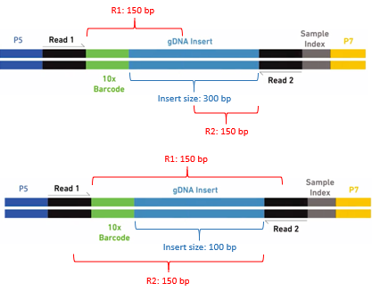

# trimR2bc - A trimming tool for linked (barcoded) reads
Tool for removing barcode contamination in linked reads.

## Why linked reads might need trimming ##

Linked reads have a barcode, which is the 16 first bases in R1. The barcode is added during fragmentation, so fragments originating from the same original DNA molecule will have the same barcode. This is a great aid when aligning the reads and assembling e.g. habloblocks.

The barcode is removed from R1 by the barcode-aware aligners.

If the insert size is of propper length the barcode will not be present in R2 (image upper). On the other hand, if the insert size is too short this will lead to sequencing the barcode in the end of R2 and thus leading to barcode contamination (image lower).



This contamination can act like adapter contamination, which interferes with the mapping of the reads and increases the risk of calling false positive variants.

trimR2bc removes the barcode contamination from R2.

## Usage ##

trimR2bc is used as follows:

```
./trimR2bc.py <R1fastqfile> <R2fastqfile> <whitelist> <R2outfile> 1>>bctrim_stats.txt
```

## Description ##

Program meant for linked reads. It trims barcodes off R2 if the insert size was too short and therefore leads to contamination.
Checks if the 16 first bases in R1 are barcodes in the whitelist.
If positive, it reverse compliments the barcode, and checks if the rev_barcode is in the corresponding R2. If negative, it searches for rev_bc with one mismatch.
Searches from the 5' end and cuts the first match it finds.
Cuts line 4 (containing the base QS) to same length as line 2.
If R1 or R2 are shorter than 16 bp it will not trim.
After trim it checks if line 2 contains nothing (''). If true, replaces '' with 'N' and replaces line 4 with '!'.

**Input**: R1 and R2 must be in two seperate fastq files. If they are gzipped, they must end with '.gz'.

**Output**: A barcode trimmed R2 fastq file (not gzipped).
